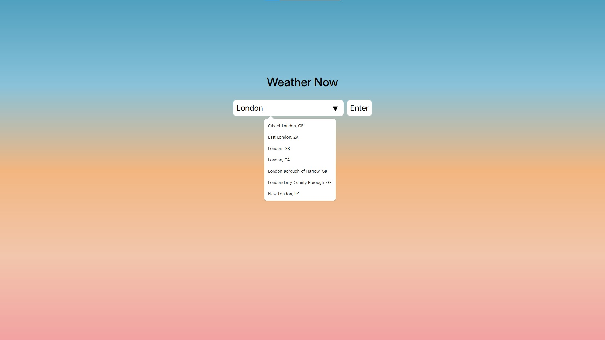

# Weather Now

## Screenshots

## About the App

This is a simple weather app that gives an entered city's weather information.

It makes API calls to OpenWeather's current weather data (https://openweathermap.org/current).

It makes calls with city name and optionally with country name, instead of latitude and longitude, because it seemed a better UX.

I downloaded, sorted, processed, and used as datalist OpenWeather's JSON file containing data about 22,635 major cities.
