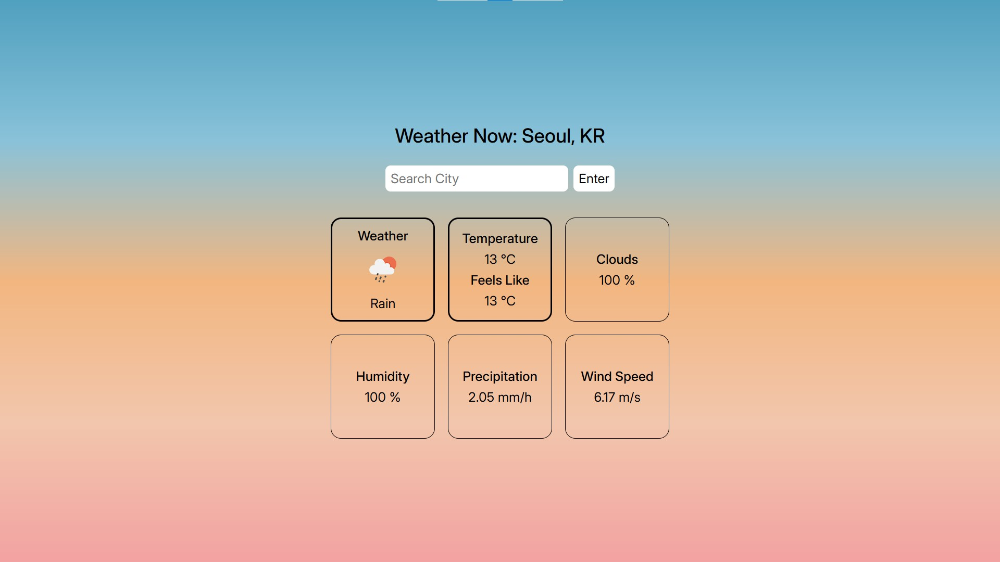

# Weather Now (날씨 지금)

## Screenshots (스크린샷)

## About the App

This is a simple weather app that gives entered city's weather information.

It makes API calls to OpenWeather's current weather data (https://openweathermap.org/current).

It makes calls with either city name or city name with country name, instead of latitude and longitude, because it seemed a better UX.

I downloaded, sorted, processed, and used as datalist OpenWeather's JSON file containing data about 22,635 major cities, making search easier (e.g. in the first screenshot, searching "London" gives many datalist options to choose from).

## 앱에 관하여

이 앱은 입력한 도시의 날씨 정보를 보여주는 간단한 앱입니다.

OpenWeather의 실시간 날씨 정보(https://openweathermap.org/current) API를 이용합니다.

아무리 유명한 도시라도 위도와 경도를 외우고 있는 사람은 거의 없다 생각해, 위도와 경도 대신 도시명 혹은 도시명+국가명을 입력하게 만들었습니다.

22,635 주요 도시 정보를 담고 있는 OpenWeather의 JSON 파일을 다운로드 및 가공한 후, datalist로 만들어 검색을 더욱 편리하게 했습니다(예로, 첫 번째 스크린샷에서 "London" 검색 후 많은 datalist 옵션 중 가장 적절한 도시명 선택 가능).
